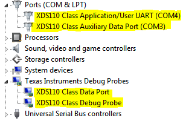
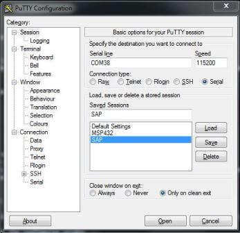
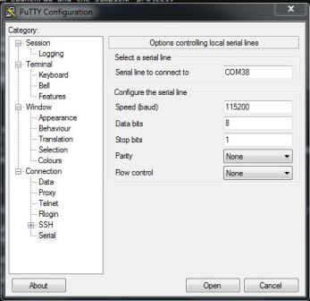

## Frequently Asked Questions

* [What if I installed the SimpleLink CC13X2 SDK at a non-default location (e.g. Not at ``C:\ti\simplelink_cc13x2_sdk_2_30_00_45``)?](#default)
* [Referenced project 'tirtos_builds_CC1352R1_LAUNCHXL_release_ccs' does not exist in the workspace. Why do I get this error?](#missing-dependency)
* [How should I keep my application based on a TI SDK under version control?](#versioning)
* [I am using a LaunchPad device, how can I view display data?](#display)
---

### What if I installed the SimpleLink CC13X2 SDK at a non-default location (e.g. Not at ``C:\ti\simplelink_cc13x2_sdk_2_30_00_45``)?

All projects reference files from the SDK using environment variables, you
can change this in your IDE's project files.

**CCS**

No changes to the project is necessary. You just need to ensure that Code
Composer Studio was able to discover the SimpleLink CC13X2 SDK in the
available *RTSC Products* tab.

---
### Referenced project 'tirtos_builds_CC1352R1_LAUNCHXL_release_ccs' does not exist in the workspace. Why do I get this error?

All projects depend on an external TI-RTOS project providing the TI-RTOS kernel. The
TI-RTOS project should be imported as part of each example and named
``tirtos_builds_CC1352R1_LAUNCHXL_release_ccs``.

If this project is not imported into the workspace, make sure the correct SDK version
mentioned in the GitHub repo is installed and detected by the IDE.

---
### How should I keep my application based on a TI SDK under version control?

There are many ways to solve and address this issue. We are merely presenting
one suggested workflow out of the many combinations that exist.

Since this is an advanced topic, it has its own page dedicated to it.
You can read more here: [Version Control](suggested_workflow.md)

---

### I am using a LaunchPad device, how can I view display data?
LaunchPad projects are already set up to use the TI Driver Display. For more
information about the Display driver please see the Display.h driver
documentation in the Simplelink CC13X2 SDK (`docs/tidrivers/tidriversAPI.html`)

To setup your PC to receive this data please follow the steps below:

1. Install PuTTY or another serial terminal emulator
1. Use the Windows Device Manager (Start &rarr; Run &rarr; `mmc devmgmt.msc`
    &rarr; Ok) to determine which COM port you should connect to:

    
    * Note the COM port number of the `XDS110 Class Application/User UART` listed.
1. Configure putty as a serial console with 115200 8N1.
1. Fill in the Serial Line field with the COM port from above.
1. When configured correctly, the program should look as below:

| Main Screen                                   | Serial Screen                         |
|:---------------------------------------------:|:-------------------------------------:|
|   |  |

**You may need to unplug/replug your LaunchPad and restart PuTTY if you do not see any output.**
